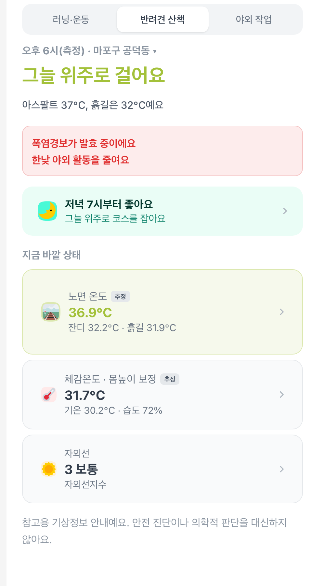
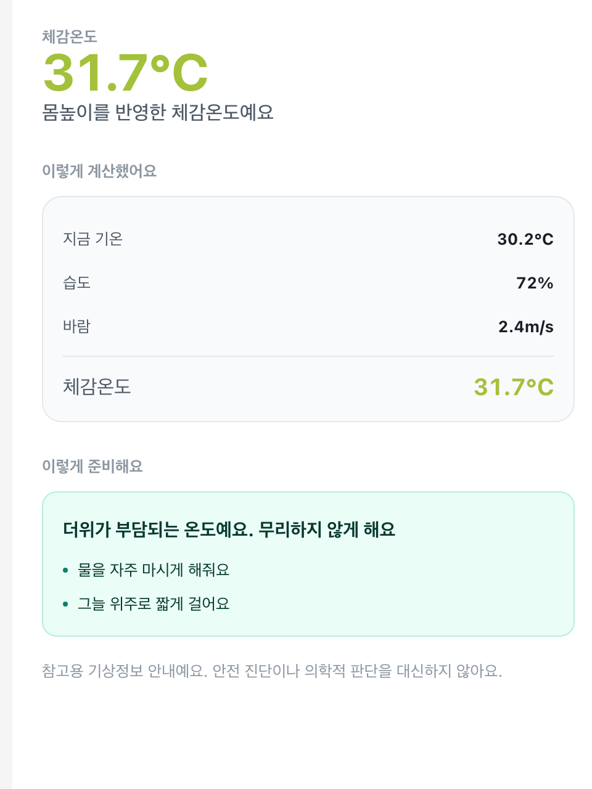
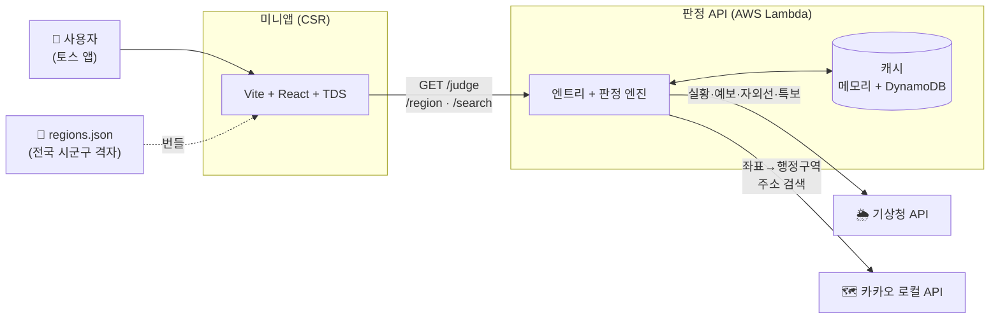
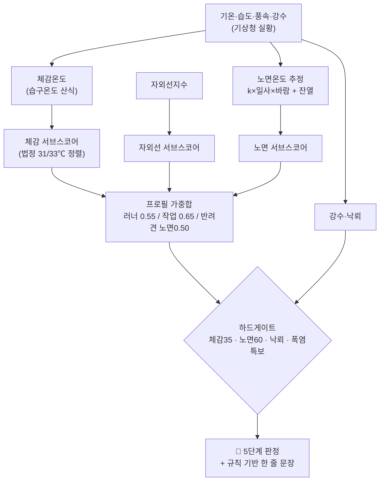

<div align="center">

# ☀️ 오늘 나가도 되나

**체감온도·자외선·노면온도를 하나의 판정으로 합쳐, "지금 나가도 되는지"를 한 줄로 알려주는 앱인토스 미니앱**

기존 날씨앱은 *관측값을 나열*하지만, 이 앱은 **프로필별 기준으로 판정을 내립니다.**
러너·야외 노동자·반려견 보호자가 각자 다른 숫자를 봐야 한다는 문제에서 출발했어요.

<sub>토스 바이브코딩 챌린지 출품작 · 팀 프로젝트 -김정현·윤정연·차윤희</sub>

</div>

---

## 📱 화면

| 진입 (F1) | 홈 · 판정 (F2) | 지표 상세 (F5) |
| :---: | :---: | :---: |
|  |  |  |
| 프로필 선택 · 위치 안내 | 한 줄 판정 · 폭염특보 배너 · 최적 시간창 · 지표 3종 | 계산 근거 공개 · 단계별 조언 |

---

## ✨ 핵심 기능

- **프로필별 판정** — 러닝·운동 / 야외 작업 / 반려견 산책. 같은 날씨도 프로필에 따라 판정·문구·지표 위계가 전부 달라져요.
- **노면온도 (차별점)** — 기상청이 주지 않는 노면온도를 **추정 모델**로 계산. 아스팔트·보도블록·잔디·흙 4종. 항상 `추정` 배지 표기.
- **체감온도 직접 산출** — 기상청 체감온도 API 종료(2026.5)에 대응해 습구온도 산식으로 직접 계산.
- **폭염특보 배너** — 기상특보를 요청 지역 기준으로 필터해 노출.
- **최적 시간창** — 06~24시를 계산해 "지금 이후 나가기 좋은 가장 이른 구간"을 추천.
- **정확한 위치 라벨** — 카카오 역지오코딩(경계 기반)으로 동 단위까지 정확하게.

### 판정 5단계

| 등급 | 의미 | 색 | 러너 예시 | 반려견 예시 |
| :---: | --- | :---: | --- | --- |
| 1 | 좋음 | `#0C816A` | 지금 나가기 좋아요 | 지금 산책하기 좋아요 |
| 2 | 보통 | `#A3C13A` | 물만 챙기면 괜찮아요 | 그늘 위주로 걸어요 |
| 3 | 주의 | `#F5A524` | 강도를 낮추고 짧게 뛰어요 | 아스팔트는 피하고 짧게 |
| 4 | 위험 | `#F2711C` | 지금은 실내가 좋아요 | 흙길이나 잔디로만 가요 |
| 5 | 매우 위험 | `#E03131` | 저녁까지 미뤄요 | 배변만 짧게, 안고 이동해요 |

---

## 🏗 시스템 설계



- **CSR 미니앱**이 판정 API를 호출하고, **계산은 서버가 전부** 합니다. 프론트는 응답 JSON을 그리기만 해요.
- **격자(nx/ny) 단위 캐싱** — 같은 동네 사용자가 기상청 호출 1회를 공유해 트래픽 한도·응답속도(2초 제약)를 대응.
- 원래 **Cloudflare Workers**로 배포했다가 **AWS Lambda**로 이관(어댑터 + DynamoDB 캐시). 판정 로직은 무수정 재사용.

### 판정 파이프라인



> **노면온도 추정 모델**: `T_road = T_air + k_surface × 일사량정규화 × 바람감쇠 + 잔열항`
> 표면별 계수 분리 + 일몰 후 지수감쇠 + 시간축 축열 스무딩. 미국·서울 실측 대비 오차 1℃ 이내.

---

## 📂 폴더 구조

```
today-outside/
├── app/                     # 프론트 (앱인토스 CSR)
│   └── src/
│       ├── screens/         #   F1~F16 화면 (Home, Details, Timeline, …)
│       ├── constants/       #   판정 색·조언 문구(uvAdvice, feelsLikeAdvice)
│       ├── lib/             #   judgeApi, geo(좌표변환), regions
│       └── hooks/           #   위치·저장소·설정
├── worker/                  # 판정 API (TypeScript)
│   └── src/
│       ├── engine.ts        #   체감·노면·서브스코어·게이트·문장 (판정 엔진)
│       ├── kma.ts           #   기상청 연동 + 캐시
│       ├── geo.ts           #   격자↔위경도 변환(LCC), 태양고도
│       ├── kakao.ts         #   역지오코딩
│       ├── lambda.ts        #   AWS Lambda 어댑터 + DynamoDB 캐시
│       └── index.ts         #   라우팅 (/judge /region /search /health)
├── data/regions.json        # 전국 시군구 격자 매핑
└── docs/                    # 기획서 · 디자인프레임 · judge-api-spec
```

---

## 🛠 기술 스택

| 영역 | 스택 |
| --- | --- |
| **프론트** | Vite · React · TypeScript · TDS(토스 디자인 시스템) · 앱인토스 SDK |
| **백엔드** | TypeScript · Cloudflare Workers → **AWS Lambda** (DynamoDB 캐시) |
| **외부 API** | 기상청 동네예보 / 생활기상지수 / 기상특보 · 카카오 로컬 |
| **테스트** | Vitest (판정 로직·게이트·파싱 단위 테스트) |

---

## 🔌 API

계산은 서버가 전부. 프론트는 응답 JSON을 그리기만 해요. 전체 계약은 **[`docs/judge-api-spec.md`](docs/judge-api-spec.md)** 참고.

| 엔드포인트 | 설명 |
| --- | --- |
| `GET /judge?nx&ny&profile&area` | 판정 + 지표 + 시간창 (프론트가 쓰는 메인) |
| `GET /region?lat&lon` | 좌표 → 행정구역 (동 단위 라벨) |
| `GET /search?query` | 지역명 검색 (읍면동까지) |
| `GET /health` | 헬스체크 |

---

## 🚀 로컬 실행

```bash
# 프론트
cd app
npm install
npm run dev          # granite dev (Vite)

# 판정 API (테스트)
cd worker
npm install
npm test             # vitest
```

출시 번들: `cd app && npm run build` → `today-outside.ait` 생성 → 앱인토스 콘솔 업로드.

---

## 👥 팀 · 역할

| 담당 | 내용 |
| --- | --- |
| 백엔드 · 조언 콘텐츠 | 판정 엔진 설계, 기상청/카카오 연동, 지표 조언 |
| 프론트 화면 | F1~F16 화면 구현, 상태·라우팅 |
| 인프라 · 배포 | AWS Lambda 이관, DynamoDB 캐시, 주소검색 |

---

## ⚠️ 정책·정직성 원칙

- **의료·진단 표현 금지** — "기상정보 안내"로 포지셔닝. 조언은 물·그늘·휴식 같은 생활 안내만.
- **추정값은 추정으로** — 노면온도엔 항상 `추정` 배지 + 계산 근거 + "손등 7초 테스트" 병기.
- **생성형 AI 미사용** — 판정 문장은 규칙 기반 생성(프로필 × 등급 × 시간대)으로 고지 의무 회피.
- **출처 명시** — 모든 지표에 "출처: 기상청".
